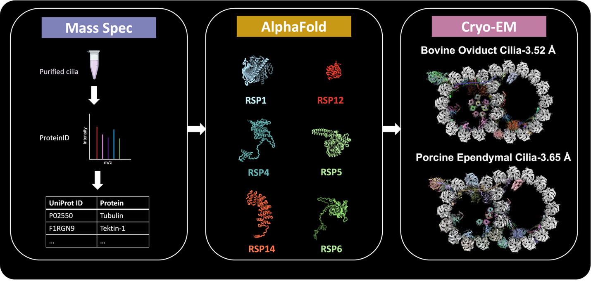
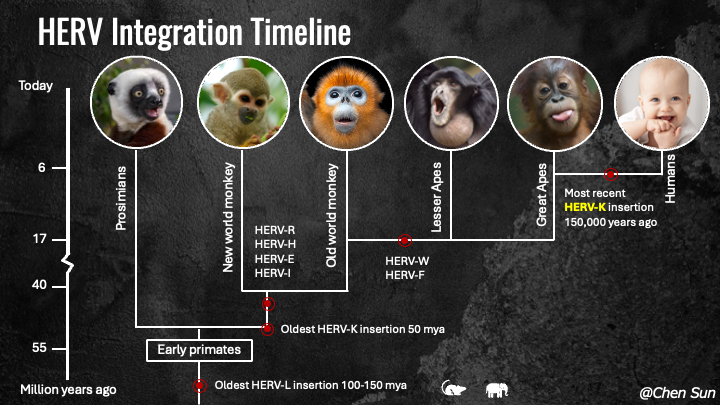
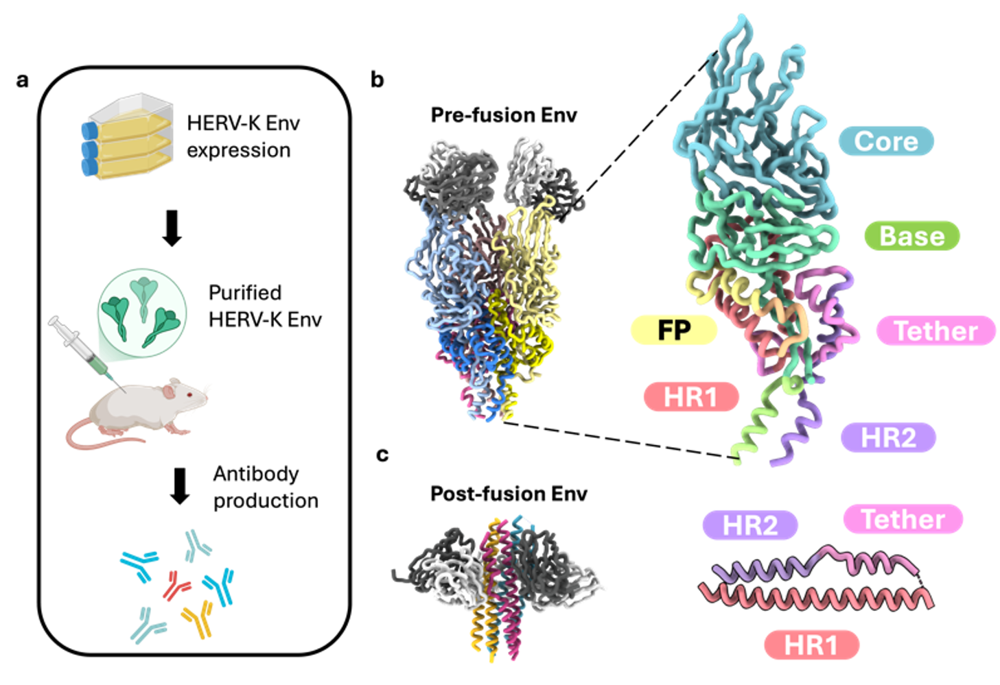

## Major Research Experiences

### 1. Structural Diversity of Mammalian Motile Cilia
- Developed a novel protocol for isolating swine ependymal and bovine oviduct cilia.
- Used single-particle cryo-EM to resolve high-resolution structures of mammalian motile cilia doublet microtubules.
- Uncovered structural diversity across mammalian axonemes.

*Figure 1. AI-assisted protein identification workflow.*

### 2. Human endogenous retrovirus K (HERV-K) envelope structures in pre- and post-fusion

- **First Structural Characterization**  
  This study reports the first high-resolution cryo-EM structures of the HERV-K envelope (Env) glycoprotein in both pre-fusion (2.2 Å) and post-fusion (2.8 Å) conformations.

- **Novel Monoclonal Antibodies**  
  A panel of ten novel monoclonal antibodies was developed and characterized to recognize distinct subunits and conformational states of HERV-K Env. Two antibodies, Kenv-6 and Kenv-4, facilitated structure determination.

- **Pre-fusion Env Architecture**  
  The pre-fusion Env is an elongated trimer with SU subunits forming an inverted tripod and TM subunits forming a clasp underneath. This structure is distinct from all known retroviral Env structures.

- **Engineering a Stable Pre-fusion Trimer**  
  Successful stabilization of the metastable pre-fusion Env trimer was achieved using structure-guided mutations: a disulfide bond, furin site modification, and trimerization domain fusion.

- **Unique TM Features in Post-fusion State**  
  The post-fusion TM forms a typical six-helix bundle but includes a unique “tether helix” not observed in other retroviral Envs, indicating structural divergence.

- **SU Fold is Unique Among Retroviruses**  
  The SU subunit adopts a novel fold with a β-sheet-rich architecture, showing no structural homology to HIV-1, SIV, or Syncytin-2 SU, except for a conserved β-sheet in the base domain.

- **Antibody Epitope Mapping**  
  Kenv-6 binds a conserved, conformational epitope at the SU apex, while Kenv-4 recognizes a post-fusion TM epitope spanning two protomers. These mAbs are valuable tools for detecting native Env.

- **Biological and Therapeutic Relevance**  
  HERV-K Env is aberrantly expressed in various cancers and autoimmune diseases. The described structures and antibodies provide a foundation for developing diagnostics and immunotherapies.

- **Glycan Shield Analysis**  
  Env carries 10 N-glycans per monomer, providing moderate shielding (31% on SU, 57% on TM). It is less shielded than HIV-1 Env, potentially exposing vulnerable epitopes for immune targeting.

- **Implications for Disease and Therapy**  
  Findings suggest the structural basis for HERV-K Env’s role in disease and highlight its potential as a therapeutic target for cancer and autoimmune conditions.

*Figure 2. HERV integration timeline.*

*Figure 3. Antibody assisted structure determination of HERV-K env in pre- and post- fusion conformations.*
### 3. 3D Molecular Architecture of CAR T Cell Immune Synapses Revealed by Cryo-ET
- Investigated immune synapse formation between CAR T cells and cancer cells using cryo-electron tomography.
- Revealed key structural features enhancing our understanding of CAR T cell-mediated cytotoxicity.

### 4. Tulane Virus Structure and Receptor Switch
- Studied a novel Tulane virus variant with abolished receptor binding due to minor capsid protein mutations.
- Developed an innovative virus purification method, significantly enhancing yield and purity.
- Resolved the structure of the variant at 2.6 Å, revealing the structural basis for the receptor switch.

### 5. Method Development in Single-Particle Cryo-EM
- Developed a web app for real-space helical indexing, enabling easy and reliable determination of helical parameters.
- Addressed air-water interface challenges by using encapsulin-based encaging.
- Optimized data collection strategies for the Volta phase plate to improve efficiency.
